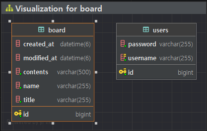
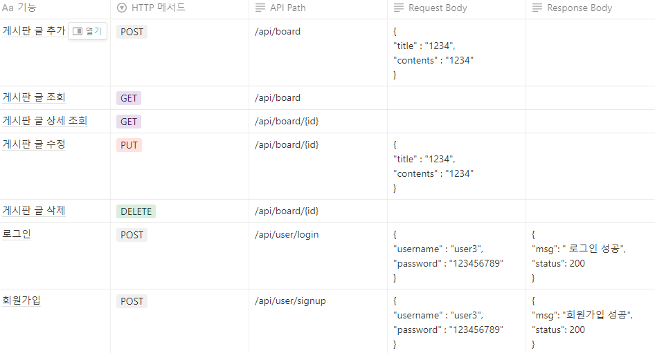

# Spring Lv.2

# ERD

# API 명세서

<aside>
❓ Why: 과제 제출시에는 아래 질문을 고민해보고 답변을 함께 제출해주세요.

</aside>
1. 처음 설계한 API 명세서에 변경사항이 있었나요?
   변경 되었다면 어떤 점 때문 일까요? 첫 설계의 중요성에 대해 작성해 주세요!
=> Response body, Request body의 추가
=> 시간절약도 가능하고, RESTful한 설계가 가능했다.

2. ERD를 먼저 설계한 후 Entity를 개발했을 때 어떤 점이 도움이 되셨나요?
=> ERD 설계 그대로 Entity를 만들면 되서 고민하면서 코딩을 안해도 바로바로 ERD보면서 작성 할 수 있었다.

3. JWT를 사용하여 인증/인가를 구현 했을 때의 장점은 무엇일까요?
=> 동시 접속자가 많을 때 서버 측 부하 낮춰줌
   Client, Sever 가 다른 도메인을 사용할 때 편리

4. 반대로 JWT를 사용한 인증/인가의 한계점은 무엇일까요?
=>구현의 복잡도 증가
   JWT 에 담는 내용이 커질 수록 네트워크 비용 증가 (클라이언트 → 서버)
   이미 생성된 JWT 를 일부만 만료시킬 방법이 없음
   Secret key 유출 시 JWT 조작 가능

5. 만약 댓글 기능이 있는 블로그에서 댓글이 달려있는 게시글을 삭제하려고 한다면 무슨 문제가 발생할까요? Database 테이블 관점에서 해결방법이 무엇일까요?
=> 게시글을 삭제하면 기존 게시글에 달려있는 댓글은 살아있다, 이것을 Database 외래키제약조건을 사용해서 문제를 해결할 수 있을거 같다.

6. IoC / DI 에 대해 간략하게 설명해 주세요!
=> Ioc : 메소드나 객체의 호출작업을 개발자가 결정하는 것이 아니라, 외부에서 결정되는 것을 의미한다. 
=> DI : 객체를 직접 생성하는 게 아니라 외부에서 생성한 후 주입 시켜주는 방식이다.
