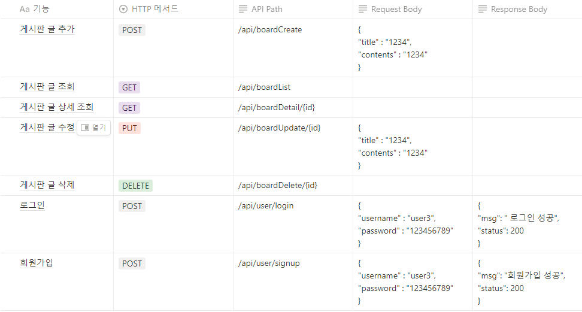

# Spring Lv.1

# Use Case

# API 명세서

<aside>
❓ Why: 과제 제출시에는 아래 질문을 고민해보고 답변을 함께 제출해주세요.

</aside>

1. 수정, 삭제 API의 request를 어떤 방식으로 사용하셨나요? (param, query, body)

    ⇒  body

2. 어떤 상황에 어떤 방식의 request를 써야하나요?
- Path Variable
    - 데이터를 받기 위해서는 `/star/{name}/age/{age}`  이처럼 URL 경로에서 데이터를 받고자 하는 위치의 경로에 {data} 중괄호를 사용한다.
    - `(@PathVariable String name, @PathVariable int age)`
        - 그리고 해당 요청 메서드 파라미터에 @PathVariable 애너테이션과 함께 {name} 중괄호에 선언한 변수명과 변수타입을 선언하면 해당 경로의 데이터를 받아올 수 있습니다.
- form 태그 POST,  Query String 방식
    - `?name=Robbie&age=95` 처럼 데이터형태를 처리함
    - @RequestParam `(@RequestParam String name, @RequestParam int age)`
        - 해당 요청 메서드 파라미터에 @RequestParam 애너테이션과 함께 key 부분에 선언한 변수명과 변수타입을 선언하면 데이터를 받아올 수 있습니다.
    - `?name=Robbie&age=95` 처럼 데이터가 두 개만 있다면 괜찮지만 여러 개 있다면 @RequestParam 애너테이션으로 하나 씩 받아오기 힘들 수 있습니다. 이때 @ModelAttribute 사용해서 객체로 데이터를 받아옴
- @RequestBody
    - HTTP Body에 JSON 데이터를 담아 서버에 전달할 때 해당 Body 데이터를 Java의 객체로 전달 받을 수 있다.
    - HTTP Body에 `{"name":"Robbie","age":"95"}`  `JSON` 형태로 데이터가 서버에 전달되었을 때 @RequestBody 애너테이션을 사용해 데이터를 객체 형태로 받을 수 있습니다.

3. RESTful한 API를 설계했나요? 어떤 부분이 그런가요? 어떤 부분이 그렇지 않나요?

    ⇒ API의 리소스 식별자를  중복 없이 고유하게 잘 만들었고, 해당 API에 적절하게 HTTP 메서드를 사용했다.

4.  적절한 관심사 분리를 적용하였나요? (Controller, Repository, Service)

    ⇒ DTO,Entity는 잘 분리했지만 현제는 컨트롤러에 Controller, Repository(메모리 DB), Service가 작성되어 있는 거 같습니다.

5. API 명세서 작성 가이드라인을 검색하여 직접 작성한 API 명세서와 비교해보세요!

검색해서 찾은건다. 기능, 메서드, path는 동일하다.

추가 내용 쿼리스트링, Request Body, Response Body, 상태 코드, 예외까지 있는걸 볼 수 있다.

---
# Spring Lv.2

# ERD

# API 명세서

<aside>
❓ Why: 과제 제출시에는 아래 질문을 고민해보고 답변을 함께 제출해주세요.

</aside>
1. 처음 설계한 API 명세서에 변경사항이 있었나요?
   변경 되었다면 어떤 점 때문 일까요? 첫 설계의 중요성에 대해 작성해 주세요!
=> Response body, Request body의 추가
=> 시간절약도 가능하고, RESTful한 설계가 가능했다.

2. ERD를 먼저 설계한 후 Entity를 개발했을 때 어떤 점이 도움이 되셨나요?
=> ERD 설계 그대로 Entity를 만들면 되서 고민하면서 코딩을 안해도 바로바로 ERD보면서 작성 할 수 있었다.

3. JWT를 사용하여 인증/인가를 구현 했을 때의 장점은 무엇일까요?
=> 동시 접속자가 많을 때 서버 측 부하 낮춰줌
   Client, Sever 가 다른 도메인을 사용할 때 편리

4. 반대로 JWT를 사용한 인증/인가의 한계점은 무엇일까요?
=>구현의 복잡도 증가
   JWT 에 담는 내용이 커질 수록 네트워크 비용 증가 (클라이언트 → 서버)
   이미 생성된 JWT 를 일부만 만료시킬 방법이 없음
   Secret key 유출 시 JWT 조작 가능

5. 만약 댓글 기능이 있는 블로그에서 댓글이 달려있는 게시글을 삭제하려고 한다면 무슨 문제가 발생할까요? Database 테이블 관점에서 해결방법이 무엇일까요?
=> 게시글을 삭제하면 기존 게시글에 달려있는 댓글은 살아있다, 이것을 Database 외래키제약조건을 사용해서 문제를 해결할 수 있을거 같다.

6. IoC / DI 에 대해 간략하게 설명해 주세요!
=> Ioc : 메소드나 객체의 호출작업을 개발자가 결정하는 것이 아니라, 외부에서 결정되는 것을 의미한다. 
=> DI : 객체를 직접 생성하는 게 아니라 외부에서 생성한 후 주입 시켜주는 방식이다.